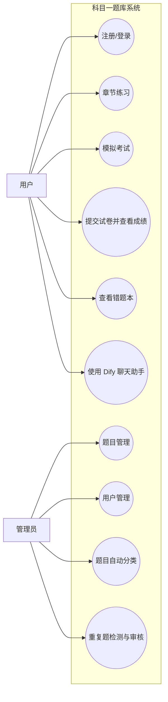
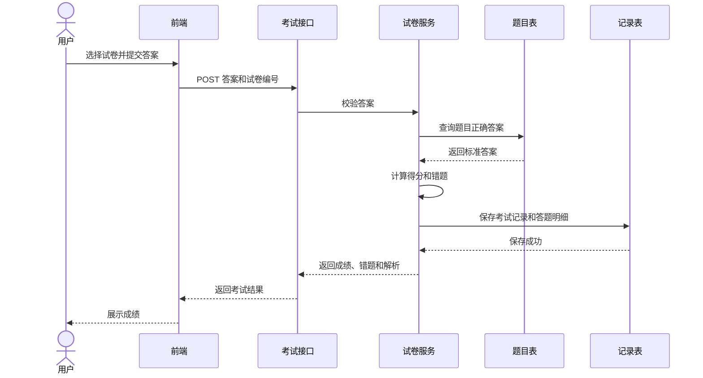
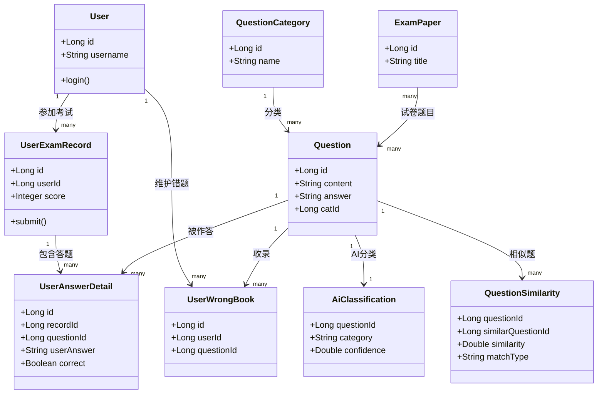
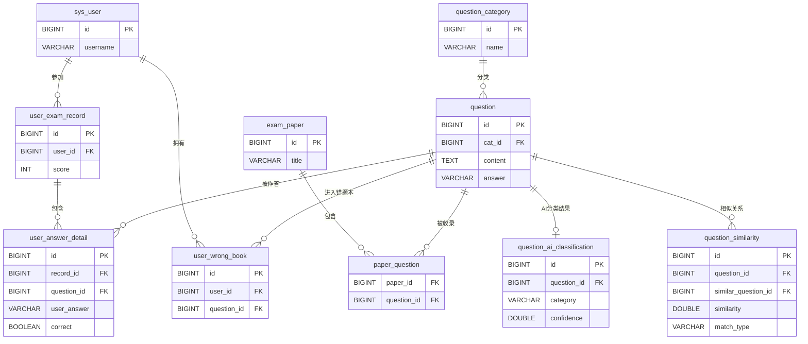

# 科目一题库系统 UML 图与 ER 图

本文档使用 Mermaid 绘图，可在支持 Mermaid 的 Markdown 编辑器、Typora、Obsidian 或 Mermaid Live Editor 中渲染，也可以截图放入答辩 PPT。

## 1. 系统用例图

## 2. 提交试卷时序图

## 3. 核心类图

## 4. 数据库 ER 图

## 答辩说明

UML 图描述系统参与者、功能流程和程序对象；ER 图描述数据库实体、字段以及主键外键关系。`question_ai_classification` 保存 AI 分类结果，`question_similarity` 保存完全重复和语义相似题集合，这两张表属于题库智能分析模块。
